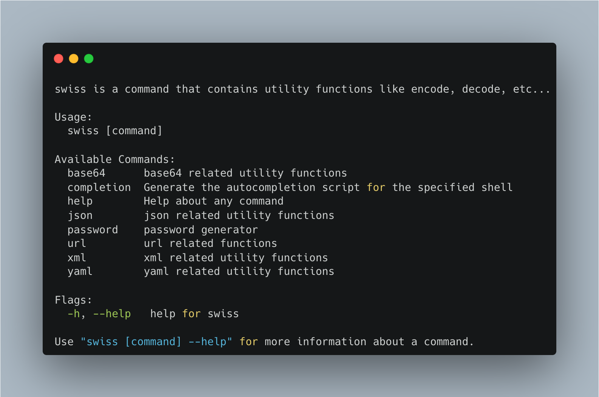

# Swiss 
Swiss Army Knife for developers to handle daily basis utility requirements like `url encode`, `password generation`, `json escape`, `json to yaml conversion`
without sending your data to online services. The main motivation is to handle those in your local to clear your concern.



## Install

```
brew tap huseyinbabal/tap
brew install swiss
```

More installation options will come

# Todo
- [x] JSON
  - [x] Beautify
  - [x] Uglify
  - [x] ToYAML
  - [x] ToXML
  - [x] ToCSV
  - [x] ToTSV
  - [x] Escape
  - [x] Unescape
  - [x] ToGoStruct
- [x] Base64 
  - [x] Encode
  - [x] Decode
- [x] YAML
  - [x] Format
  - [x] Beautify
  - [x] ToJSON
  - [x] ToXML
  - [x] ToCSV
- [x] Password
  - [x] Generator
- [x] URL
  - [x] Encode
  - [x] Decode
- [x] XML
  - [x] ToJSON
  - [x] ToCSV
  - [x] ToYAML
  - [x] Escape
  - [x] Unescape
  - [x] Beautify
  - [x] Uglify
- [x] RSS
  - [x] ToJSON
- [x] CSV
  - [x] ToJSON
  - [x] ToXML
  - [x] ToYAML
  - [x] Escape
  - [x] Unescape
